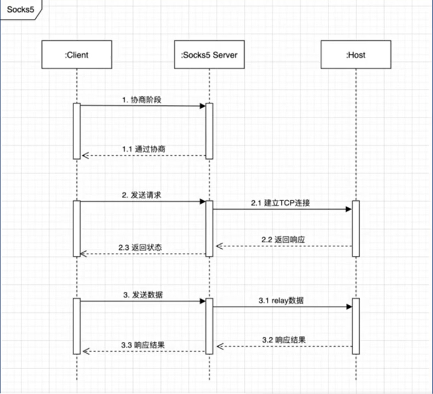

## Socks5 Server
我们来写一个 socks5 代理服务器，对于大家来说，一提到代理服务器，第一想到的是翻墙。不过很遗憾的是，socks5 协议它虽然是代理协议，但它并不能用来翻墙，它的协议都是明文传输。
这个协议历史比较久远，诞生于互联网早期。它的用途是，比如某些企业的内网为了确保安全性，有很严格的防火墙策略，但是带来的副作用就是访问某些资源会很麻烦。
socks5 相当于在防火墙开了个口子，让授权的用户可以通过单个端口去访问内部的所有资源。实际上很多翻墙软件，最终暴露的也是一个 socks5 协议的端口。
如果有同学开发过爬虫的话，就知道，在爬取过程中很容易会遇到IP访问频率超过限制。这个时候很多人就会去网上找一些代理IP池，这些代理IP池里面的很多代理的协议就是 socks5.

我们先来看一下最终写完的代理服务器的效果。
我们启动这个程序，然后在浏览器里面配置使用这个代理，此时我们打开网页。
代理服务器的日志，会打印出你访问的网站的域名或者 IP ，这说明我们的网络流量是通过这个代理服务器的。
我们也能在命令行去测试我们的代理服务器。我们可以用 curl --socks5 + 代理服务器地址，后面加个可访问的 URL，如果代理服务器工作正常的话，那么 curl 命令就会正常返回。


接下来我们来了解一下 socks5 协议的工作原理。正常浏览器访问一个网站，如果不经过代理服务器的话，就是先和对方的网站建立 TCP 连接，然后三次握手，握手完之后发起 HTTP 请求，然后服务返回 HTTP 响应。如果设置代理服务器之后，流程会变得复杂一些。
首先是浏览器和 socks5 代理建立 TCP 连接，代理再和真正的服务器建立 TCP 连接。这里可以分成四个阶段，握手阶段、认证阶段、请求阶段、relay 阶段。
第一个握手阶段，浏览器会向 socks5 代理发送请求，包的内容包括一个协议的版本号，还有支持的认证的种类，socks5 服务器会选中一个认证方式，返回给浏览器。如果返回的是 00 的话就代表不需要认证，返回其他类型的话会开始认证流程，这里我们就不对认证流程进行概述了。




### test echo-server:
```bash
$ go run echo-server.go
# change to another tab
$ nc 127.0.0.1 1080
```