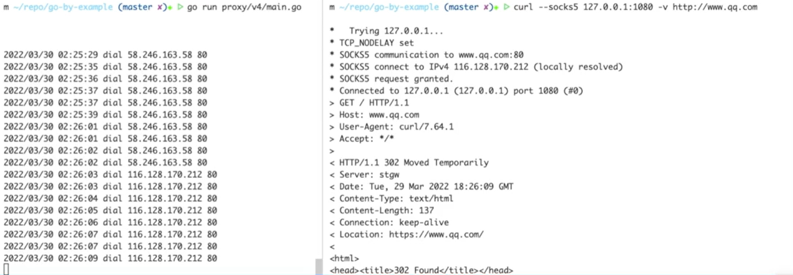

[TOC]
## Socks5 Server
### 原理
我们来写一个 socks5 代理服务器，对于大家来说，一提到代理服务器，第一想到的是翻墙。不过很遗憾的是，socks5 协议它虽然是代理协议，但它并不能用来翻墙，它的协议都是明文传输。
这个协议历史比较久远，诞生于互联网早期。它的用途是，比如某些企业的内网为了确保安全性，有很严格的防火墙策略，但是带来的副作用就是访问某些资源会很麻烦。
socks5 相当于在防火墙开了个口子，让授权的用户可以通过单个端口去访问内部的所有资源。实际上很多翻墙软件，最终暴露的也是一个 socks5 协议的端口。
如果有同学开发过爬虫的话，就知道，在爬取过程中很容易会遇到IP访问频率超过限制。这个时候很多人就会去网上找一些代理IP池，这些代理IP池里面的很多代理的协议就是 socks5.

我们先来看一下最终写完的代理服务器的效果。
我们启动这个程序，然后在浏览器里面配置使用这个代理，此时我们打开网页。
代理服务器的日志，会打印出你访问的网站的域名或者 IP ，这说明我们的网络流量是通过这个代理服务器的。
我们也能在命令行去测试我们的代理服务器。我们可以用 curl --socks5 + 代理服务器地址，后面加个可访问的 URL，如果代理服务器工作正常的话，那么 curl 命令就会正常返回。



接下来我们来了解一下 socks5 协议的工作原理。正常浏览器访问一个网站，如果不经过代理服务器的话，就是先和对方的网站建立 TCP 连接，然后三次握手，握手完之后发起 HTTP 请求，然后服务返回 HTTP 响应。如果设置代理服务器之后，流程会变得复杂一些。
首先是浏览器和 socks5 代理建立 TCP 连接，代理再和真正的服务器建立 TCP 连接。这里可以分成四个阶段，握手阶段、认证阶段、请求阶段、relay 阶段。
第一个握手阶段，浏览器会向 socks5 代理发送请求，包的内容包括一个协议的版本号，还有支持的认证的种类，socks5 服务器会选中一个认证方式，返回给浏览器。如果返回的是 00 的话就代表不需要认证，返回其他类型的话会开始认证流程，这里我们就不对认证流程进行概述了。


### TCP echo Server
第一步，我们先在 go 里面写一个简单的 TCP echo server，为了方便测试，server 的工作逻辑很简单，你给他发送啥，他就回复啥，代码：[TCP echo server](echo-server.go)
首先在 main 函数里面先用 net.listen 去监听一个端口，会返回一个server，然后在一个死循环里面，每次去 accept 一个请求，成功就会返回一个连接。接下来的话我们在一个process函数里面去处理这个连接。
注意这前面会有个 go 关键字，这个代表启动一 go routinue，可以暂时类比为其他语言里面的启动一个子线程，只是这里的 go routinue 的开销会比子线程要小很多，可以很轻松地处理上万的开发，
接下来是这个 process 函数实现，首先第一步会先加一个 defer connection.close()，defer是 Golang 里面的一个语法，这一行的含义就是代表在这个函数退出的时候要把这个连接关掉，否则会有资源的泄露。
接下来我们用 bufio.NewReader 来创建一个带缓冲的只读流，这个在前面的猜谜游戏里面也有用到，带缓冲的流的作用是，可以减少底层系统调用的次数，比如这里为了方便是一个字节一个字节的读取，但是底层可能合并成几次大的读取操作，并且带缓冲的流会有更多的一些工具函数用来读取数据
我们可以简单地调用那个 readbyte 函数来读取单个字节，再把这一个字节写进去连接。
##### test echo-server:
```bash
$ go run echo-server.go
# change to another tab
$ nc 127.0.0.1 1080
```

### Auth 认证阶段
就这样我们就已经完成了一个能够返回你输入信息的一个 TCP server ，接下来我们是要开始实现协议的第一步，认证阶段，从这一部分开始会变得比较复杂。我们实现一个空的 auth 函数，在 process 函数里面调用，再来编写 auth 函数的代码我们回忆一下认证阶段的逻辑，首先第一步的话，浏览器会给代理服务器发送一个包，然后这个包有三个字段，第一个字段，version 也就是 协议版本号 ，固定是 5 第二个字段 methods，认证的方法数目第二个字段 每个 method的编码， 0代表 不需要认证，2 代表用户名密码认证我们先用 read bytes 来把版本号读出来，然后如果版本号不是 socket 5 的话直接返回报错，接下来我们再读取 method size，也是一个字节。然后我们需要我们去 make 一人相应长度的一个slice ，用 io.ReadFull 把它去填充进去。

此时curl命令肯定是不成功的，因为协议还没实现完成。但是看日志发现，version和method可以正常打印，说明当前的实现是正确的。

##### test
curl测试socks5代理命令（注意在cmd下）
```bash
$ curl --socks5 127.0.0.1:1080 -v https://www.qq.com
```

### 请求阶段